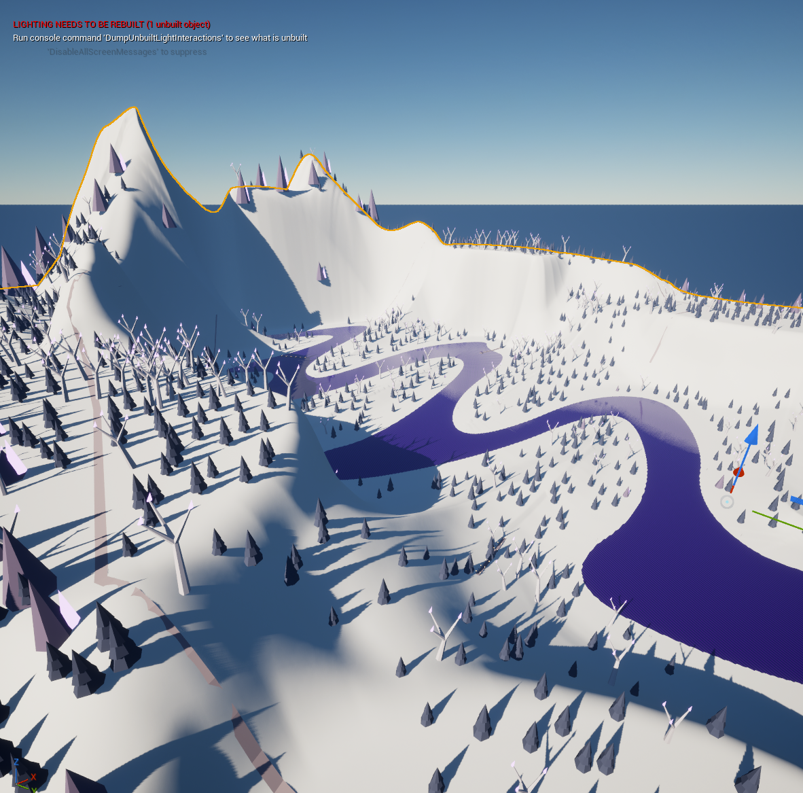

# Game Design Portfolio

This section shows how I approach gameplay systems, player understanding, iteration, and design validation.

My primary professional lane is Senior QA / QAE. The design work shown here covers professional content and systems contributions from Ashes of Creation plus active development of Project Fibsh. The Fibsh showcase follows selected concepts through PH asset work, Blender validation, Unreal implementation, packaged builds, and test evidence.

- [Open the live Game Design Portfolio](https://kintsugikoko.github.io/KintsugiKoko/game-design.html)
- [Review the public Project Fibsh summary](../fibsh/README.md)

## Design Focus

- Interconnected gameplay systems
- Equipment, economy, and progression relationships
- Player-facing clarity and feedback
- Character and visual-direction review
- Level composition and spatial readability
- Product scope and acceptance criteria
- Persistence and safe state behavior
- Playtest planning and iteration
- Translating design intent into observable behavior

## Professional Design Contribution

### Ashes of Creation Content And Systems Design

**Status:** Professional team contribution.

At Intrepid Studios, I contributed directly to content and systems design while working across Narrative Design and the Ashes of Creation Economy team. I was preparing to transition formally into design when Intrepid closed.

My contribution included:

- designing quest and world-event content with the Narrative Design team
- designing equipment recipes with the Economy team
- helping translate system goals, item behavior, and progression changes for an equipment rework across two milestones
- reviewing interactions between equipment, economy, progression, rewards, UI, tools, and supporting data
- identifying implementation gaps and player-facing risk during iteration
- using test coverage, playtest findings, and cross-discipline discussion to support design decisions
- communicating with design, engineering, production, art, and QA partners

These contributions were delivered within cross-discipline teams. Proprietary requirements, internal documentation, tuning values, implementation details, and team-authored assets remain private.

## Active Game Development

### Project Fibsh

**Status:** Active private Unreal Engine game development with selected public documentation and evidence.

Project Fibsh is an original game about a city cat's strange fishing vacation at Lake Glorp. Its development evidence shows how that premise moves through visual direction, spatial planning, PH art, Blender development, Unreal implementation, packaged smoke testing, and owner-reviewed iteration.

Detailed mechanics, Unreal source and content, Blender source files, packaged builds, commercial planning, and the complete validation record remain private.

## Published Project Fibsh Evidence

The public page already contains evidence across four distinct stages. Each artifact is labeled so a visual target is not confused with an implemented result.

### Character And Gameplay Direction

[](https://kintsugikoko.github.io/KintsugiKoko/game-design.html#visual-evidence)

This approved concept board establishes the city-cat silhouette, Lake Glorp mood, fishing posture, and cast-ready readability.

### Lake Glorp Level Concept

[](https://kintsugikoko.github.io/KintsugiKoko/game-design.html#visual-evidence)

The orthographic plan supports design decisions about the dock approach, shoreline loop, central fishing focus, readable landmarks, and supporting activity spaces.

### Environment Direction Studies

The [world-scale environment concept](../../docs/assets/fibsh/lake-glorp-world-concept.png) explores crystal-lit water, route rhythm, forest enclosure, settlement silhouettes, and warm navigation lights. The [player-view boat keyframe](../../docs/assets/fibsh/lake-glorp-boat-keyframe-concept.png) explores camera height, the city-cat silhouette, shoreline landmarks, arrival mood, and a possible traversal beat.

### Canon Master And Blender Development

[](https://kintsugikoko.github.io/KintsugiKoko/game-design.html#visual-evidence)

The canon Master is shown in Unreal Editor with the mountain silhouette, river route, terrain scale, and forest coverage established. PH actors and lighting identify the next environment pass. A separate [Blender gameplay-view structural pass](../../docs/assets/fibsh/lake-glorp-blender-environment-wip.png) tests terrain, shoreline, and camera coverage, while the [Parry PH rig stress render](../../docs/assets/fibsh/parry-blender-rig-stress-wip.png) records fishing-arm deformation, equipment clearance, and pose-range review.

### Packaged Unreal Validation

[](https://kintsugikoko.github.io/KintsugiKoko/game-design.html#visual-evidence)

The packaged contact sheet records the functional flow through menu, movement, cast, wait, bite, reel, result, journal, pause, and persistence review.

## Design And Validation Loop

```text
Define the goal -> bound the scope -> implement one change -> validate the result -> decide the next action
```

| Design area | Purpose | Current public status |
| --- | --- | --- |
| Product and ship-state intent | Establish the current goal, accepted scope, known evidence, ranked risks, and next action | Workflow documented, product details private |
| Gameplay transaction | Keep one player-facing change bounded enough to iterate and verify | Follow-up UX and persistence fixes documented at a high level |
| Persistence behavior | Preserve understandable durable state across quit and relaunch | Validation evidence summarized, implementation private |
| System boundaries | Prevent one feature from silently owning unrelated rules or release decisions | Public workflow principle |
| Release evidence | Separate build success, automated checks, deterministic validation, and human usability review | Evidence layers documented with owner-gated decisions |

## Product Scope And Acceptance Criteria

Canonical product and ship-state documents establish what the current change is trying to achieve, which behavior is accepted, what remains unknown, and which risks block the next decision.

That structure supports design iteration because it keeps the player-facing goal connected to observable behavior without treating a successful build or automated check as proof of a complete experience.

Questions used during review include:

- What should the player understand after this interaction?
- Which system owns the state change, feedback, and persistence rule?
- What evidence would show that the change works as intended?
- Which defects block the next milestone, and which are accepted PH or current-scope limits?
- What still requires human play or usability review?

## Public / Private Boundary

### Published Evidence

- Scope-control and acceptance-criteria habits
- Controlled writer and recovery processes
- Isolated build and validation stages
- Separation of automated, deterministic, and human evidence
- High-level gameplay, UX, and persistence iteration milestones
- Selected flattened concept boards, PH Blender renders, and packaged Unreal captures
- Ranked defects, residual risk, and owner-gated decisions

### What Remains Private

- Detailed mechanics and unreleased design records
- Unreal source, content, and project internals
- Blender files and final source assets
- Packaged builds and complete validation evidence
- Commercial plans, schedules, credentials, and platform details

## Design And Iteration Process

1. State the player-facing or product goal.
2. Map the systems and content responsibilities.
3. Define acceptance criteria, failure states, and known risks.
4. Implement or document the smallest controlled change.
5. Run the appropriate build, deterministic, automated, and human checks separately.
6. Distinguish observed evidence from assumptions.
7. Rank defects and approve the next action through owner review.

## Evidence And Artifacts

- [Project Fibsh Public Summary](../fibsh/README.md)
- [Controlled Development Workflow](../fibsh/README.md#controlled-development-workflow)
- [Recent Workflow Milestones](../fibsh/README.md#recent-workflow-milestones)
- [Published Visual Development Evidence](https://kintsugikoko.github.io/KintsugiKoko/game-design.html#visual-evidence)
- [Senior QA / QAE Signal](../fibsh/README.md#senior-qa--qae-signal)

## Ownership And Maturity Labels

- Ashes of Creation entries describe my contributions within cross-discipline teams while respecting team authorship and confidential implementation details.
- Concept marks approved visual or spatial direction.
- PH marks placeholder assets used to test composition, scale, rigging, readability, and gameplay flow.
- Unreal captures show current in-engine implementation.
- Packaged captures document observed functional behavior from a reviewed build.
- Automated checks, deterministic validation, and human play remain separate evidence layers.

## Evidence Maintenance

- Keep concept, Blender, Unreal, and validation artifacts labeled by their actual maturity.
- Add only owner-reviewed flat exports, never private source files or packaged builds.
- Keep the public summary aligned with current verified milestones.
- Preserve the distinction between functional validation and release presentation.
